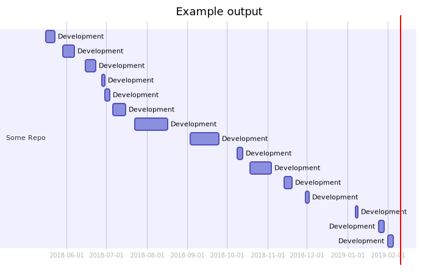
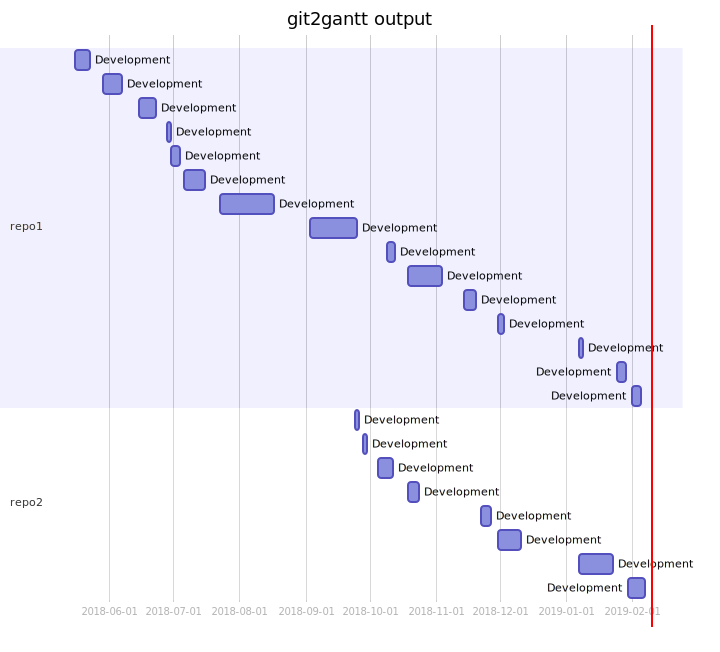

# git2gantt

## Introduction

`git2gantt` is a simple tool that's designed to create
[mermaid](https://mermaidjs.github.io/) [gantt chat
code](https://mermaidjs.github.io/gantt.html) from one or more git
repositories.

## Setup

`git2gantt` is written in, and requires, Python 3 -- likely Python 3 at the
oldest. While it should run itself, I've also used
[`pipenv`](https://pipenv.readthedocs.io/en/latest/) to help control extra
things, like being able to easily [lint](https://www.pylint.org/) the code.

To set up using pipenv, simply type:

```sh
$ make setup
```

If you need to run pylint over the code, simply type:

```sh
$ make lint
```

## Usage

```
usage: git2gantt [-h] [-a AUTHOR] [-d DESCRIPTION] [-t TITLE] [-v]
                 repos [repos ...]

git history to mermaid gantt chart tool

positional arguments:
  repos

optional arguments:
  -h, --help            show this help message and exit
  -a AUTHOR, --author AUTHOR
                        Limit to commits by the given author.
  -d DESCRIPTION, --description DESCRIPTION
                        Description to give each session.
  -t TITLE, --title TITLE
                        The title for the chart.
  -v, --version         Show version information.
```

To produce a gantt chart for a single repository, simply:

```sh
$ git2gantt /path/to/repo
```

The mermaid code will be output. Capture that and run it through mermaid to
create the chart. The output will look something like this:



It's possible to run `git2gantt` over more than one repository at a time.
For example:

```sh
$ git2gantt /path/to/repo1 /path/to/repo2
```

The resulting output with me something like:



The title of the chart can be changed using the `--title` parameter. The
title of each "coding session" can be set with the `--description`
parameter. For other changes to the output, simply edit the output before
passing it through Mermaid.

## Assumptions

This tool was initially written as a way of visualising the work done on a
number of work projects, so for now it concentrates just on work days. What
a working day is will be different from person to person, and culture to
culture, etc. I aim to carry on working on this tool and make it a lot more
flexible in this regard.

This is just an early test to get things up and going.

## TODO

- [ ] Be smarter about the concept of a "working day".
- [ ] Allow the option to not even worry about "working days".
- [ ] Add a parameter that gives some wiggle room for a coding session
      length.
- [ ] Look at including Mermaid such that the output is optionally an actual
      chart.
- [ ] Have repository checking/cleaning do a bit of a search for the root of
      the repository -- that way people don't need to specify the root of
      the repository, just some location within it.

[//]: # (README.md ends here)
